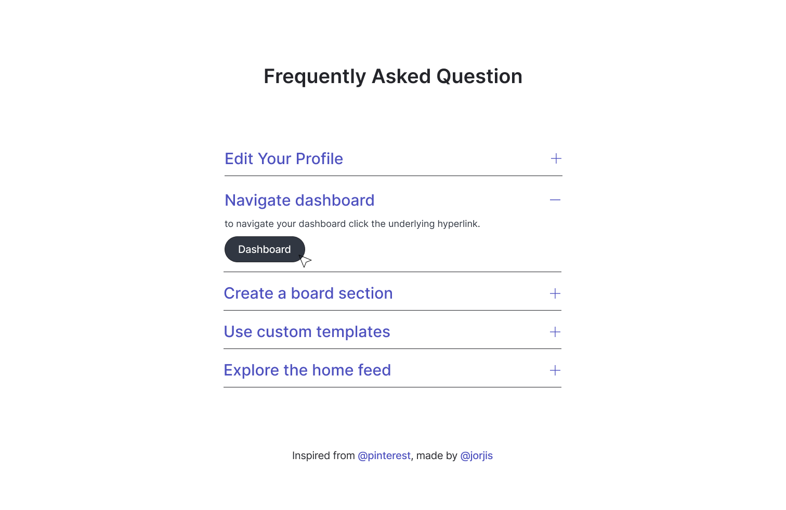

# Check out this project [here 👈](https://feasiblecomponents-faq.netlify.app/)

## Little optimization :

- Handle event bubbling
- event propagation

## Script overview :

- ```javascript
    event.stopPropagation(), DOM manipulation, EventListener, Basic Selectors
  ```

## Validation :

- HTML5 [https://validator.w3.org/]
- CSS3 [https://jigsaw.w3.org/css-validator/]
