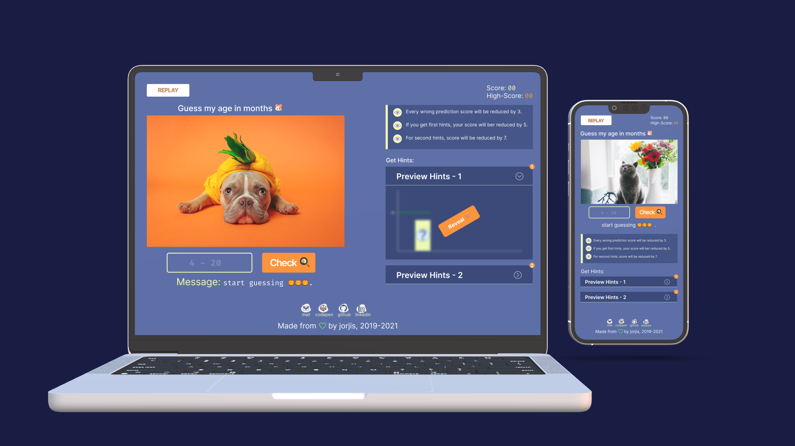

# **Connect me on :**

[![Hackerrank][hackerrank-shield]][hackerrank-url]
[![Leetcode][leetcode-shield]][leetcode-url]
[![Codepen][codepen-shield]][codepen-url]
[![LinkedIn][linkedin-shield]][linkedin-url]

# Toggle the [project](https://predictmyage.netlify.app/ "predict my age") 👋

 

## Complexity faced during this project :

---

> ### Event debounce

> ### Event bubbling & capturing

> ### Perfect Shuffle

 

## Tools and Technology used for this project :

#

- ### Languages:
  - HTML5
  - CSS3
  - Vanilla JS (ES6)

 

- ### Tools & Technology:

  - Sass
  - netlify
  - npm & modules
  - webpack5 , cli , plugins
  - Adobe Photoshop ,Figma

<!-- MARKDOWN LINKS & IMAGES -->

[hackerrank-shield]: https://img.shields.io/badge/-Hackerrank-black.svg?style=flat-square&logo=hackerrank&color=555&logoColor=white
[hackerrank-url]: https://www.hackerrank.com/_jorjis
[leetcode-shield]: https://img.shields.io/badge/-Leetcode-black.svg?style=flat-square&logo=leetcode&color=555&logoColor=white
[leetcode-url]: https://leetcode.com/_jorjis/
[codepen-shield]: https://img.shields.io/badge/-Codepen-black.svg?style=flat-square&logo=codepen&color=555&logoColor=white
[codepen-url]: https://codepen.io/jorjis
[linkedin-shield]: https://img.shields.io/badge/-LinkedIn-black.svg?style=flat-square&logo=linkedin&colorB=555
[linkedin-url]: https://www.linkedin.com/in/jorjis-hasan-4163a81a4/
