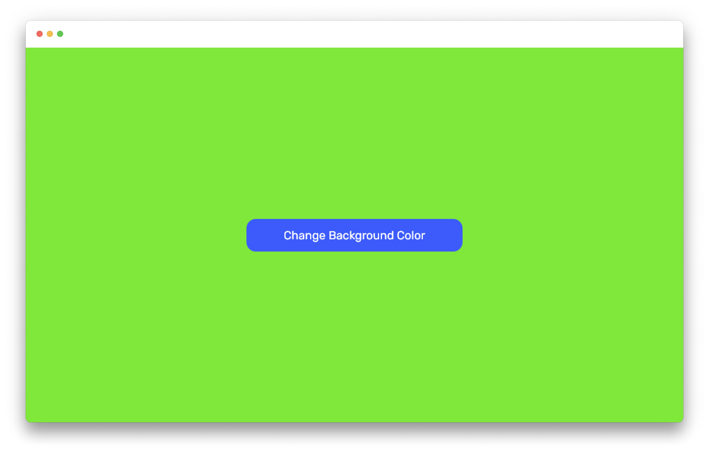

# Background Color Changer

- [Background Color Changer](#background-color-changer)
  - [Overview](#overview)
    - [The challenge](#the-challenge)
    - [Screenshot](#screenshot)
    - [Links](#links)
  - [Author](#author)

## Overview

### The challenge

Change the background color by generating random rgb color by clicking a button.

### Screenshot

### Links

- Live Site URL: [Netlify](https://dowgpzdqel.netlify.app/)

## Author

- GitHub - [SalahuddinAhammed](https://github.com/SalahuddinAhammed)
