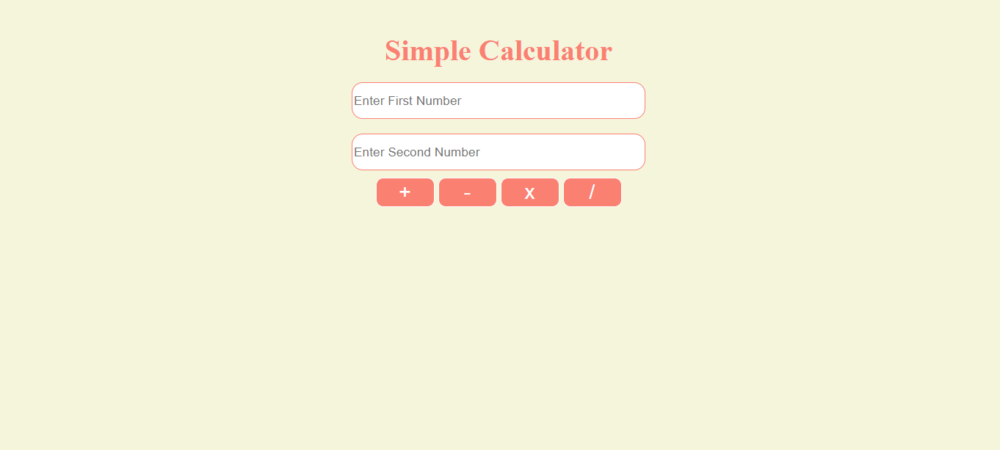
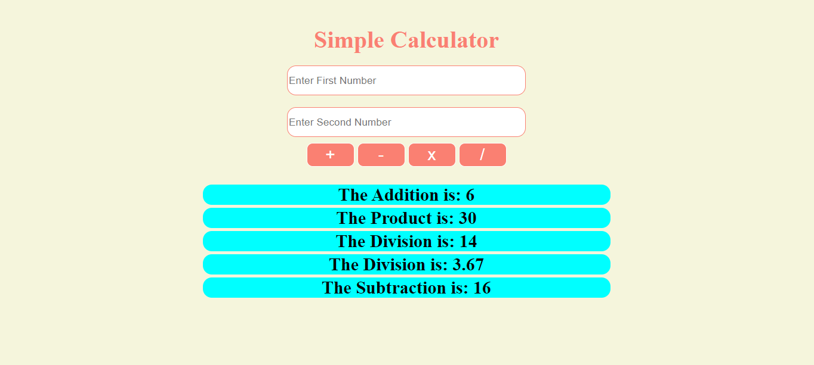
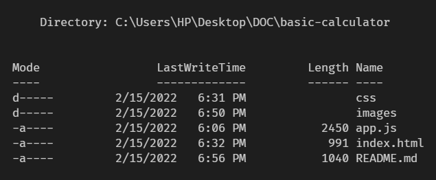

## Basic Calculator App 🖩

This is a very basic calculator app project. In this project you are going to build a simple calculator app that can do 4 fundamental operation addition, subtraction, product and division.

## UI of the App

## Description

In the first input field you need to put the first integer number. Then you need to put the next number. After putting these two values you need to select your required operation to do the calculation.

## Show Output

## Files and Folders

## Requirements

- The main requirement of this project is a laptop or PC
- Then you need a web browser like Google Chrome, Mozilla Firefox or Safari etc.
- You can use any code editors like VS Code, Sublime Text, Atom etc.
- You need the basic knowledge on HTML, & CSS

## Future Upgrade

- UI design will be upgraded
- Error handling will be added
- Will work on number conversion

Happy Coding✌️
