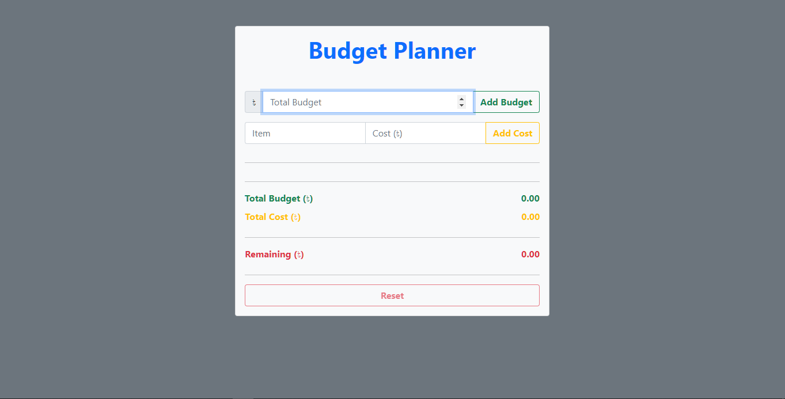
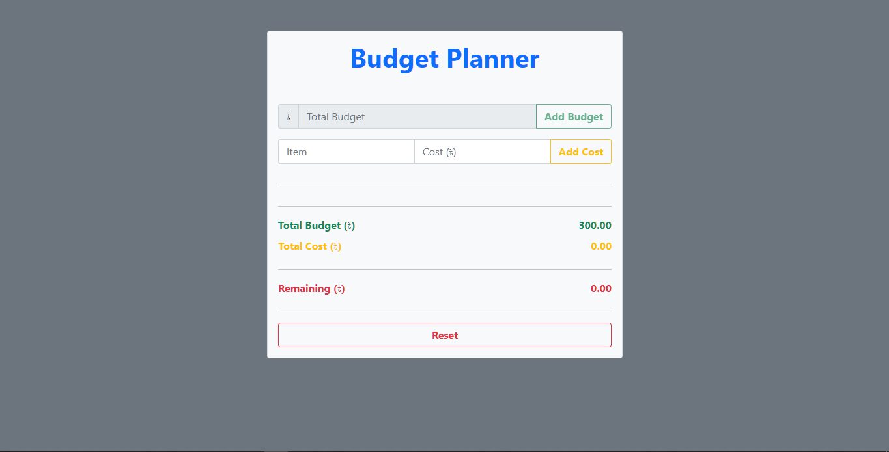
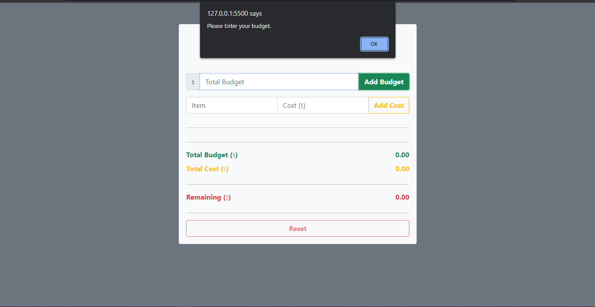
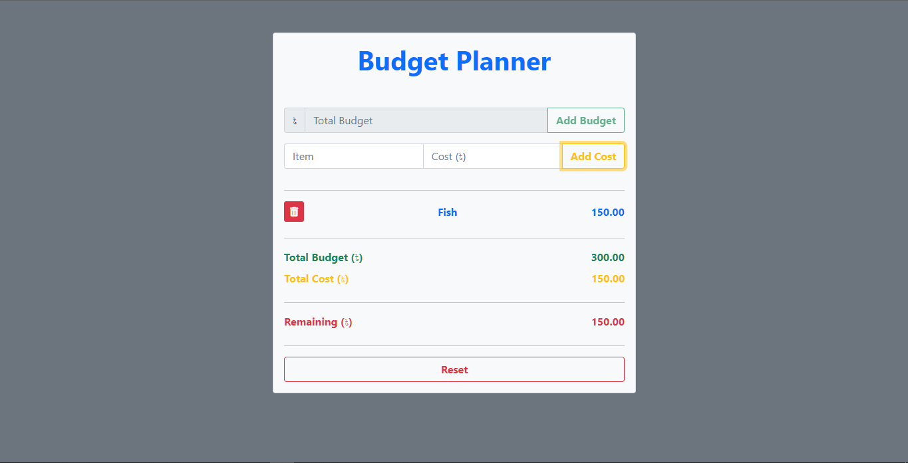
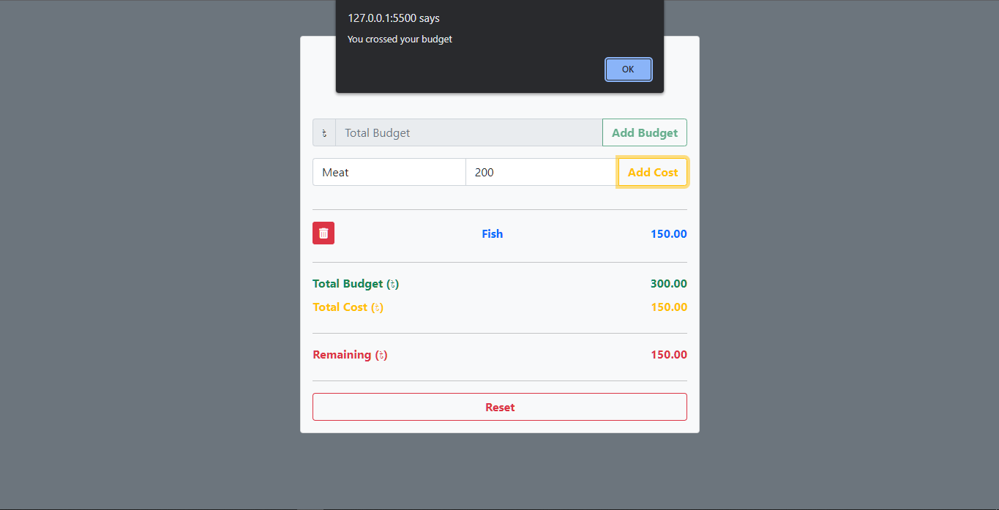
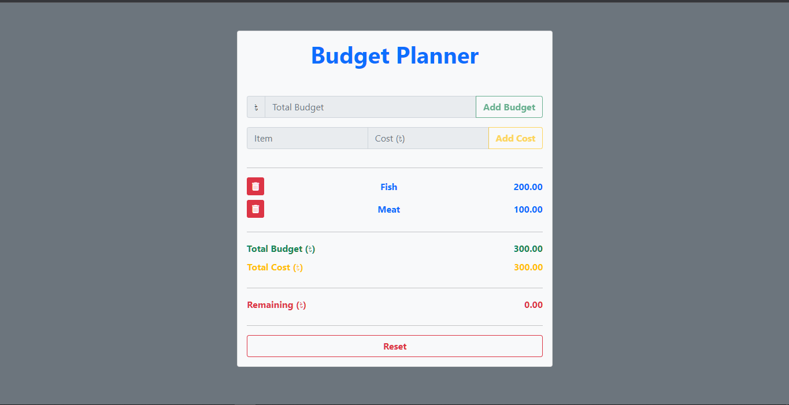

# Budget Planner

#### Overview

This is an application where you can estimate your costing with your budget

#### Features:

1. You have to put your budget first. If you don't put the budget first you will get an alert. After put your budget the input field will disable. You can't change your budget except reset.
   
   
   
2. You have to enter data in every input fields. Otherwise it will show an alert.
   
3. You can delete your data if you want.
   
4. If Costing crosses your budget it will show an alert.
   
5. If Budget and costing are equal the item and cost inputs will disable. If you delete one data then it will enable.
   
6. You can reset your data by pressing the reset button.

#### Live link:

https://adityackr.github.io/budget-planner/

#### Author

**Aditya Chakraborty**

- [Github](https://github.com/adityackr)
- [Facebook](https://www.facebook.com/aditya09036/)
- [LinkedIn](https://www.linkedin.com/in/aditya-cuet/)
