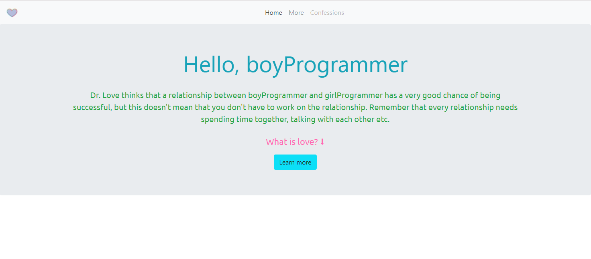
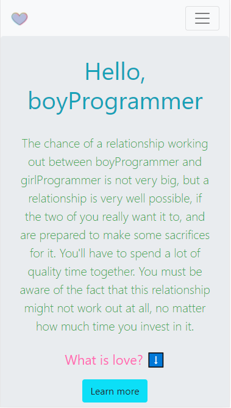

<h1 align="center"> Love Calculator </h1> <br>
<p align="center">
  <a href="https://programmers-love-calculator.netlify.app/">
    
  </a>
</p>

## Clone this project using command-line :

```bash
git clone https://github.com/Shoyayeb/loveCalculator.git
```

## Table of Contents

- [Introduction](#introduction)
- [Instruction](#instruction)
- [Author](#author)
- [Languages](#languages)

## Introduction

Love calculator is a website that can be used as a fun calculator to measure the percentage of love. It is not related to real life but fun to use.

**Available for both mobile and desktop.**

<p align="center">
  
</p>

## Instruction

A few of the things you need to do to calculate with Love Calculator:

- Enter your name
- Enter other ones name
- Then you should see a message before showing the real percentage
- After finding the percentage the website should tell you a brief details about what you should do about the percentage of love to make it work

<br/>

## Author

<br/>

### This project is created by [Shafin](https://github.com/Shoyayeb)

<h3>📫 How to reach me <a href="mailto:sa.fine@outlook.com">sa.fine@outlook.com</a></h3>

<br/>

## Languages

- HTML5
- CSS3
- BootStrap
- JavaScript

## Live Link:

## [Programmers Love Calculator](https://programmers-love-calculator.netlify.app/)

##### This website is created only for fun and learning purpose and not to hurt anyones feelings.
