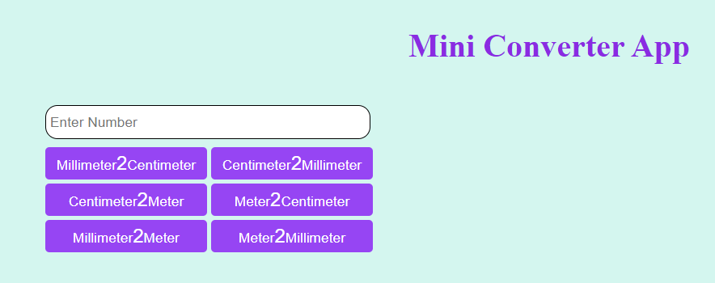
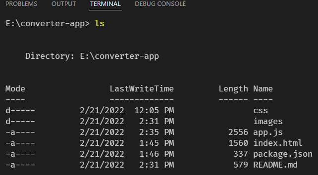
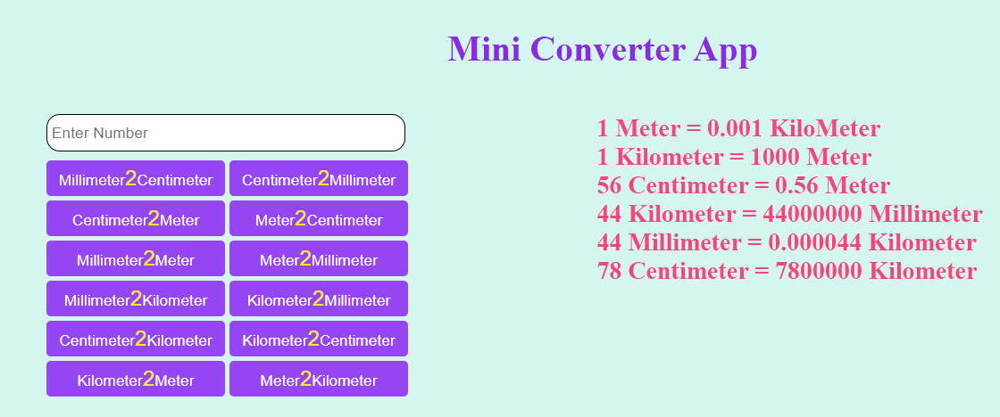

## Mini Converter APP 📲

This is a mini length converter app. It can make some SI unit conversion of length. This app will be able to convert SI unit like millimeter, centimeter, meter, kilometer. 

## UI of the APP

## Description

There is a one input field. That will accept a number. There are some buttons labeling with the conversion unit. After clicking the button conversion will be completed according to the button calculation. After that the converted result will be shown in the UI.

## Conversion Table

| Convert From | Convert To | Input Value  | Converted Value    |
| ------------ | ---------- | ------------ | ------------------ |
| Millimeter   | Centimeter | 1 Millimeter | 0.1 Centimeter     |
| Centimeter   | Millimeter | 1 Centimeter | 10 Millimeter      |
| Centimeter   | Meter      | 1 Centimeter | 0.1 Meter          |
| Meter        | Centimeter | 1 Meter      | 100 Centimeter     |
| Millimeter   | Meter      | 1 Millimeter | 0.001 Meter        |
| Meter        | Millimeter | 1 Meter      | 1000 Millimeter    |
| Millimeter   | Kilometer  | 1 Millimeter | 0.000001 Kilometer |
| Kilometer    | Millimeter | 1 Kilometer  | 1000000 Millimeter |
| Centimeter   | Kilometer  | 1 Centimeter | 0.00001 Kilometer  |
| Kilometer    | Centimeter | 1 Kilometer  | 100000 Centimeter  |
| Kilometer    | Meter      | 1 Kilometer  | 1000 Meter         |
| Meter        | Kilometer  | 1 Meter      | 0.001 Kilometer    |

## Requirements

1. Hardware
   - Laptop/PC
2. Software
   - Browser : Google Chrome/Mozilla Firefox
   - Code Editor : VS Code/Atom/Sublime Text
3. Technology
   - HTML
   - CSS
   - Vanilla JavaScript
   - DOM Manipulation
   - ES6 (Arrow Function,Template String)

## File Structure

## Sample Output

## Limitations

1. Button toggle option is missing
2. Previous output has also shown with the present output in the UI

## Future Upgrade

1. Error handling
2. More conversion will be added

Happy Coding ✌️
