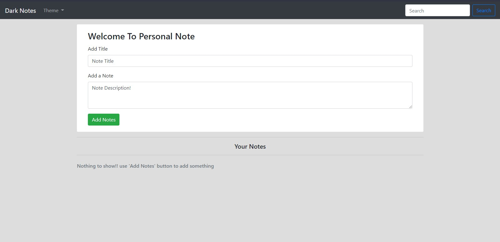
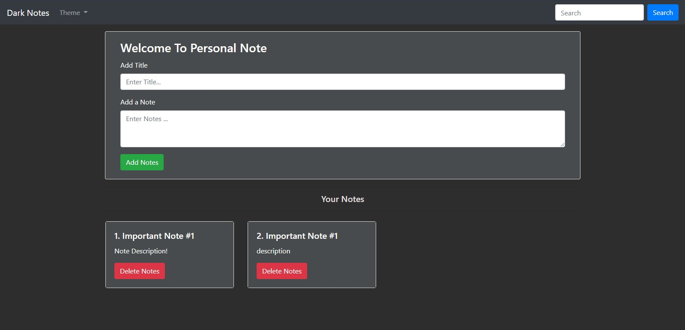
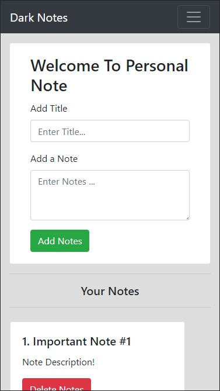

# Note-taker

An application to take your notes and store them in browser.

## Made-with

- `Bootstrap`
- `Vanilla JavaScript`

## [Live Preview](https://note-taker-realdarkcode.netlify.app/)

## Features:

- `Three different themes`
- `Responsive`
- `Works Offline`

## Screenshots:

### default-homepage

### dark-theme

### responsive

